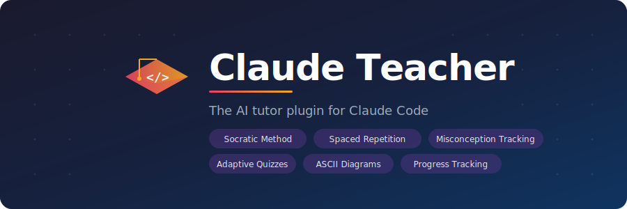

<p align="center">
  
</p>

<p align="center">
  <strong>The most attentive AI tutor for Claude Code</strong><br/>
  Teaches any subject by guiding, not giving answers. Tracks your knowledge across sessions.<br/>
  Quizzes with spaced repetition. Catches wrong reasoning. Adapts to you.
</p>

<p align="center">
  <a href="#installation"></a>
  <a href="LICENSE"></a>
  <a href="#skills"></a>
  <a href="#hooks"></a>
</p>

---

## Why Claude Teacher?

Most AI tools give you the answer and move on. **Claude Teacher makes you earn it** — through the Socratic method, targeted quizzes, and challenges designed around your specific misunderstandings.

**Works for any subject** — CS, math, finance, psychology, history, exam prep, side projects. Not just programming.

**It remembers everything.** Your progress, misconceptions, and learning style persist across sessions and projects. Come back next week — the tutor picks up exactly where you left off, quizzes you on what's overdue, and skips what you already know.

---

## Quick Start

```bash
# 1. Add the marketplace (one time)
claude plugins marketplace add https://github.com/yarikleto/claude-teacher-plugin

# 2. Install in your project
cd your-project
claude plugins install claude-teacher --scope project
```

**That's it.** Start a new Claude Code session — the plugin detects you're a new student and runs onboarding automatically. After that, just start learning.

> Run `/init-edu` manually at any time to set up a new project or re-do onboarding.

---

## What Happens After Setup

Teaching mode is **always on**. No commands needed. Just talk to Claude:

> *"Explain compound interest"* or *"Teach me about TCP sockets"* or *"Help me understand recursion"*

The tutor will:

1. Research the topic via web search — never hallucinates, always provides sources
2. Explain using analogies from **your** interests
3. Adapt tone and vocabulary to **your age** (a 14-year-old and a 35-year-old get very different explanations)
4. Teach in the style of **your ideal teacher** — strict professor, friendly mentor, no-nonsense coach — whatever you described during setup
5. Quiz you after 2-3 concepts
6. Ask "explain your thinking" to catch right-answer-wrong-reasoning
7. Track everything in your personal knowledge DB
8. Auto-save progress when you leave

---

## Skills

### `/init-edu` — Onboarding & Project Setup

<details>
<summary>Full onboarding in one command</summary>

**Student profile (first time only) — 9 questions, one at a time:**
- Name and age (age calibrates tone and vocabulary automatically)
- Current level and what you already know (to build on it)
- How you learn best and what frustrates you
- Goals with deadlines
- Interests (used for analogies)
- **Your ideal teacher** — describe the vibe: strict, funny, patient, direct, etc.

**Project setup:**
- `CLAUDE.md` — teacher persona + student profile + teaching rules adapted to your learning type
- `.claude/settings.json` — output style + hooks + `defaultView: chat` (hides tool noise)
- `docs/` — directory for saved explanations
- Global education DB at `~/.local/share/claude-education/`

</details>

### `/quiz-me [topic]` — Adaptive Quizzes

```
> /quiz-me personal finance

Q1 (medium): What is the difference between a Roth IRA and a Traditional IRA?

  a) Roth is pre-tax, Traditional is post-tax
  b) Roth is post-tax, Traditional is pre-tax
  c) Both are pre-tax but differ in withdrawal rules
  d) They are the same with different contribution limits
```

| Feature | How it works |
|---------|-------------|
| **Misconception-first** | Reads your unresolved misconceptions, crafts questions to test them |
| **Spaced repetition** | Picks topics due for review based on scheduling algorithm |
| **Adaptive difficulty** | Increases after 2+ correct, decreases after 2+ wrong |
| **"Explain your thinking"** | ~30% of correct answers get a "Why?" follow-up |
| **Full recording** | Every question, answer, and score saved to the grade book |
| **Auto-promotion** | Score ≥80% → promotes toward Solid. <50% → demotes to Weak |

### `/illustrate [concept]` — ASCII Diagrams

```
> /illustrate compound interest over time

  $1000 @ 10%/year

  Year 0  ████  $1,000
  Year 5  ████████  $1,611
  Year 10 ████████████  $2,594
  Year 20 ████████████████████  $6,727
               └── interest on interest, not just principal
```

6 styles: sequence diagrams, flowcharts, comparisons, architecture layers, charts, tree hierarchies. Researches official sources before drawing. Auto-saves to your reference library.

### `/progress` — Knowledge Dashboard

```
══════════════════════════════════════════════════
  KNOWLEDGE DASHBOARD
══════════════════════════════════════════════════

  Overall: 10 topics · 5 quizzes · avg 74%

  Solid (3)     ██████████████░░░░░░  30%
  Learned (5)   ██████████░░░░░░░░░░  50%
  Weak (2)      ████░░░░░░░░░░░░░░░░  20%

  OVERDUE FOR REVIEW
  · compound-interest — 3d overdue (working)
  · tcp-basics — due today (surface)

  UNRESOLVED MISCONCEPTIONS
  · tcp-congestion: "confused slow start with congestion avoidance"

  GOALS
  · Pass OS exam — 88 days away — 3/10 topics solid
══════════════════════════════════════════════════
```

Shows overdue topics with exact days, depth per topic, misconceptions, goal progress with deadline countdowns.

### `/challenge` — Mini-Tasks

Hands-on exercises designed around your weak spots and learning type:

| Learning type | Example |
|--------------|---------|
| **Project** | *"Write a function that creates a TCP socket, binds to port 0, and prints the assigned port"* |
| **Subject / field** | *"You have $500/month to invest. Allocate it between index funds, bonds, and cash. Justify your split."* |
| **Exam prep** | *"Trace quicksort on [3, 6, 1, 8, 2]. Show each partition step."* |

Targets `surface` → `working` depth promotion. Designs challenges around unresolved misconceptions.

### `/motivate` — Motivation Boost

```
╔══════════════════════════════════════════════════╗
║                                                  ║
║  "If you can't solve a problem, then there is    ║
║   an easier problem you can solve: find it."     ║
║                                                  ║
║                          — George Polya           ║
║                                                  ║
╚══════════════════════════════════════════════════╝

You've conquered 3 topics this week. This one's no different
— just needs a different angle.
```

Real quotes fetched live from APIs (ZenQuotes, Forismatic). 18 verified fallback quotes from Feynman, Curie, Dijkstra, Turing, Knuth, Polya. **Auto-triggers** when the tutor detects frustration or repeated failures.

### `/summary` — Session Recap

Full DB flush at session end. Shows what was learned, quiz results, depth changes, resolved misconceptions, spaced repetition schedule, and a prioritized plan for next time.

### `/save-progress` — Mid-Session Checkpoint

Quick save without ending the session. Use anytime you want a safety checkpoint.

### `/reset-edu` — Delete All Data

Wipes everything: profile, quiz history, topic progress, session logs, saved docs. Asks for `YES` confirmation before deleting. Run `/init-edu` afterward to start fresh.

---

## Hooks

4 hooks that automate the teaching workflow. Configured globally — work across all your learning projects.

| Hook | Trigger | What it does |
|------|---------|-------------|
| **session-start-load-db** | Session start | Loads profile, calculates overdue topics with exact days, flags weak topics — tells Claude to quiz before teaching new material |
| **stop-save-progress** | Session end | Blocks session close and reminds Claude to save progress to the DB (only fires in learning projects) |
| **post-code-review** | After code edit | Reminds tutor to ask pedagogical questions instead of just moving on |
| **post-quiz-motivate** | After code fails | Suggests encouragement when your code throws errors |

---

## Learning Types

`/init-edu` adapts to what you're studying:

| Type | Example | Claude focuses on |
|------|---------|-------------------|
| **Project** | FTP server, budget tracker, game | Skeletons, incremental building, hands-on review |
| **Subject / field** | Finance, psychology, math, CS | Concepts, real-world scenarios, comparisons, "why it matters" |
| **Exam prep** | OS exam, job interview, certification | Key concepts, practice questions, weak spots, timed drills |

---

## How It Tracks Your Knowledge

### Global Education DB

Your progress persists across all projects in `~/.local/share/claude-education/`:

```
~/.local/share/claude-education/
├── student.json       Profile — name, age, persona, interests, goals, learning style
├── dashboard.json     All topic statuses and stats at a glance
├── topics/            One file per topic — status, depth, misconceptions, review schedule
├── quizzes/           Every quiz ever taken — the grade book
├── sessions/          Session logs — what happened each day
└── docs/              Saved explanations — reusable across projects
```

### Spaced Repetition

At every session start, the hook scans all topic files, calculates exact days overdue, and tells Claude what to review first:

```
OVERDUE (quiz these first):
  - Compound interest (3d overdue, working, interval: 4d)
  - TCP basics (1d overdue, surface, interval: 1d)

WEAK (re-explain before new material):
  - OSI model (weak, surface)
```

Review intervals double on success, reset to 1 day on failure:

```
Day 1 ──► Day 2 ──► Day 4 ──► Day 8 ──► Day 16 ──► ...
         (pass)    (pass)    (pass)    (pass)

Day 1 ──► Day 2 ──► FAIL ──► Day 1 (reset, demoted to Weak)
```

### Topic Depth

| Depth | Meaning | How to advance |
|-------|---------|----------------|
| `surface` | Heard the explanation | Use it correctly in a quiz or challenge |
| `working` | Used it correctly | Explain your reasoning, handle edge cases |
| `deep` | Can teach it to others | Connect to other topics, no misconceptions |

### Misconception Tracking

When you get something wrong, the tutor records **what you said** and **why it's wrong** — not just "incorrect." Future quizzes and challenges specifically target your unresolved misconceptions.

### Age-Based Tone

The tutor calibrates vocabulary and examples automatically:

| Age | Style |
|-----|-------|
| ≤12 | Simple words, playful analogies, no jargon |
| 13–17 | Casual and clear, school/hobby examples |
| 18–25 | Adult tone, university/career examples |
| 26+ | Peer tone, real-world professional examples |

---

## Example Workflow

```
Day 1:
  /init-edu                      Onboarding — name, age, background, ideal teacher, topic
  "explain compound interest"    Researches, explains with your analogies, saves to docs/
  /illustrate growth over time   ASCII chart + sources
  /challenge                     "Allocate $500/month. Justify your split."
  /summary                       Recap + spaced repetition schedule

Day 2:
  (hook at session start)        "compound-interest is 1d overdue — quiz first"
  /quiz-me compound interest     Targets your misconceptions first
  (continue learning)            New concepts with periodic quizzes
  /save-progress                 Mid-session checkpoint
  /progress                      Dashboard: overdue topics, depth levels, goals

Day 3:
  (hook: 2 topics overdue)       Quick review before new material
  /quiz-me finance basics        9/10! Promoted to Solid
  (stuck on something)           Auto-triggers /motivate
  /summary                       Schedule set, next session plan ready
```

---

## Re-initialization

Run `/init-edu` again in any project:

```
Welcome back! What would you like to do?

  a) Set up this project for learning (keep my profile)
  b) Update my profile (change name, interests, goals, persona, etc.)
  c) Full reset — start fresh (wipes profile, keeps quiz history)
  d) Complete reset — wipe everything (profile + all progress)
```

---

## Updating

```bash
claude plugins update claude-teacher@claude-teacher-marketplace --scope project
```

Use the same `--scope` you used during install. Restart the session after updating.

## Uninstall

```bash
claude plugins uninstall claude-teacher
```

---

<p align="center">
  <strong>Stop copying answers. Start actually learning.</strong><br/>
  <sub>MIT License</sub>
</p>
