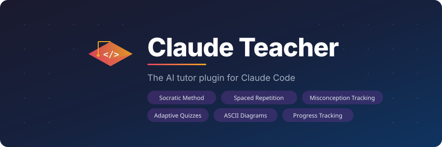

<p align="center">
  
</p>

<p align="center">
  <strong>The most attentive AI tutor for Claude Code</strong><br/>
  Teaches any subject by guiding, not giving answers. Tracks your knowledge across sessions.<br/>
  Quizzes with spaced repetition. Catches wrong reasoning. Adapts to you.
</p>

<p align="center">
  <a href="#installation"></a>
  <a href="LICENSE"></a>
  <a href="#skills"></a>
  <a href="#hooks"></a>
</p>

---

## Why Claude Teacher?

Most AI tools give you the answer and move on. **Claude Teacher makes you earn it** — through the Socratic method, targeted quizzes, and challenges designed around your specific misunderstandings.

**Works for any subject** — CS, math, finance, psychology, history, exam prep, side projects. Not just programming.

**It keeps a persistent learning record.** Your progress, misconceptions, and learning style persist across sessions and projects. Come back next week — the tutor picks up exactly where you left off, quizzes you on what's overdue, and skips what you already know.

---

## Requirements

- Current Claude Code. This release is validated with **2.1.260** and uses exec-form hook arguments and Stop `additionalContext`.
- Bash and **jq 1.6+** on `PATH` (macOS/Linux; Windows users can use WSL). Without jq, hooks exit quietly; manual skills remain available.
- Network access for source research and the demo's CDN libraries. Missing research tools are disclosed; teaching can continue from verified material.

## Quick Start

```bash
# 1. Add the marketplace (one time)
claude plugin marketplace add https://github.com/yarikleto/claude-teacher-plugin

# 2. Install in your project
cd your-project
claude plugin install claude-teacher@claude-teacher-marketplace --scope project
```

Then run `/claude-teacher:init-edu` once in that project. It walks you through onboarding and marks the folder as a learning project.

> Teaching mode activates only in projects you have run `/claude-teacher:init-edu` in. Everywhere else Claude behaves normally, so you can install the plugin at user scope without turning every repo into a classroom.

---

## What Happens After Setup

Teaching mode is active in initialized projects and respects your pace and requests to pause. No commands needed. Just talk to Claude:

> *"Explain compound interest"* or *"Teach me about TCP sockets"* or *"Help me understand recursion"*

The tutor will:

1. Research new or uncertain claims using authoritative sources and provide links
2. Explain using analogies from **your** interests
3. Adapt tone and vocabulary to **your age** (a 14-year-old and a 35-year-old get very different explanations)
4. Teach in the style of **your ideal teacher** — strict professor, friendly mentor, no-nonsense coach — whatever you described during setup
5. Quiz you after 2-3 concepts
6. Ask "explain your thinking" to catch right-answer-wrong-reasoning
7. Track everything in your personal knowledge DB
8. Checkpoint unsaved progress after responses; use `/claude-teacher:summary` when ending a lesson

---

## Skills

### `/claude-teacher:init-edu` — Onboarding & Project Setup

<details>
<summary>Full onboarding in one command</summary>

**Student profile (first time only) — 9 questions, one at a time:**
- Preferred name and optional age; personal questions can be skipped
- Current level and what you already know (to build on it)
- How you learn best and what frustrates you
- Goals with deadlines
- Interests (used for analogies)
- **Your ideal teacher** — describe the vibe: strict, funny, patient, direct, etc.

**Project setup:**
- `CLAUDE.md` — a managed teaching block, preserving existing project instructions; the personal profile stays in the global DB
- `.claude/claude-teacher.json` — marks the folder as a learning project, which is what activates the hooks
- `.claude/settings.json` — adds Explanatory output style if none is already selected, preserving other settings and hooks
- `docs/` — directory for saved explanations
- Global education DB at `~/.local/share/claude-education/`

</details>

### `/claude-teacher:quiz-me [topic]` — Adaptive Quizzes

```
> /claude-teacher:quiz-me personal finance

Q1 (medium): What is the difference between a Roth IRA and a Traditional IRA?

  a) Roth is pre-tax, Traditional is post-tax
  b) Roth is post-tax, Traditional is pre-tax
  c) Both are pre-tax but differ in withdrawal rules
  d) They are the same with different contribution limits
```

| Feature | How it works |
|---------|-------------|
| **Misconception-first** | Reads your unresolved misconceptions, crafts questions to test them |
| **Spaced repetition** | Picks topics due for review based on scheduling algorithm |
| **Adaptive difficulty** | Increases after 2+ correct, decreases after 2+ wrong |
| **"Explain your thinking"** | ~30% of correct answers get a "Why?" follow-up |
| **Full recording** | Every question, answer, and score saved to the grade book |
| **Auto-promotion** | Score ≥80% → promotes toward Solid. <50% → demotes to Weak |

### `/claude-teacher:research <task>` — Study Plan Generator

```
> /claude-teacher:research build an FTP server in C

Saved: docs/study-plan-ftp-server.md
```

Decomposes any task or project into a structured study plan with phases (prerequisites → core skills → nice-to-have). For each topic: explains why it's needed, links to real resources (official docs, tutorials, articles, videos), includes self-check questions, and estimates study time. Cross-references your existing knowledge — skips what you already know. Saves as a markdown checklist you can follow at your own pace.

### `/claude-teacher:compare <A> vs <B>` — Side-by-Side Comparisons

```
> /claude-teacher:compare REST vs GraphQL

── Compare: REST vs GraphQL ──────────────────

## What they are
**REST:** An architectural style using standard HTTP methods on resource URLs.
**GraphQL:** A query language that lets clients request exactly the data they need.

## Side-by-side comparison
| Feature        | REST               | GraphQL             |
|----------------|--------------------|---------------------|
| Data fetching  | Fixed endpoints    | Flexible queries    |
| Over-fetching  | Common             | Avoided by design   |
| Caching        | HTTP caching       | Needs custom layer  |
| Learning curve | Lower              | Higher              |
| ...            | ...                | ...                 |

## When to use which
Choose REST when: simple CRUD, public APIs, caching matters
Choose GraphQL when: complex nested data, mobile clients, multiple consumers
```

Researches both concepts via WebSearch before comparing. Includes a comparison table, concrete "when to use which" scenarios, common misconceptions about the differences, and a key takeaway. Adapts to student level. Saves to docs.

### `/claude-teacher:demo [concept]` — Animated Interactive Visualizations

```
> /claude-teacher:demo TCP 3-way handshake

Saved: docs/tcp-3-way-handshake.html
Open in any browser.
```

Generates a single `.html` file with step-by-step animated diagrams. Play/pause, prev/next controls, keyboard shortcuts (arrows + space), speed control, and an explanation panel that updates with each step. Dark theme, responsive. Styling and the UI layer load from a CDN, so first open needs a network connection. 6 styles: protocol flows, algorithm traces, state machines, data flow pipelines, memory/stack visualizations, network topology.

### `/claude-teacher:excalidraw [concept]` — Interactive Excalidraw Diagrams

```
> /claude-teacher:excalidraw TCP 3-way handshake

Saved: docs/tcp-3-way-handshake.excalidraw

Open in VS Code (Excalidraw extension) or at excalidraw.com
```

Generates editable `.excalidraw` JSON diagrams with color-coded elements, proper arrow bindings, and semantic layout. 5 styles: sequence diagrams, flowcharts, architecture layers, data structures, side-by-side comparisons. Researches sources before drawing. Diagrams are fully interactive — move, edit, annotate, export.

### `/claude-teacher:ascii [concept]` — ASCII Diagrams

```
> /claude-teacher:ascii compound interest over time

  $1000 @ 10%/year

  Year 0  ████  $1,000
  Year 5  ████████  $1,611
  Year 10 ████████████  $2,594
  Year 20 ████████████████████  $6,727
               └── interest on interest, not just principal
```

6 styles: sequence diagrams, flowcharts, comparisons, architecture layers, charts, tree hierarchies. Researches official sources before drawing. Auto-saves to your reference library.

### `/claude-teacher:progress` — Knowledge Dashboard

```
══════════════════════════════════════════════════
  KNOWLEDGE DASHBOARD
══════════════════════════════════════════════════

  Overall: 10 topics · 5 quizzes · avg 74%

  Solid (3)     ██████░░░░░░░░░░░░░░  30%
  Learned (5)   ██████████░░░░░░░░░░  50%
  Weak (2)      ████░░░░░░░░░░░░░░░░  20%

  OVERDUE FOR REVIEW
  · compound-interest — 3d overdue (working)
  · tcp-basics — due today (surface)

  UNRESOLVED MISCONCEPTIONS
  · tcp-congestion: "confused slow start with congestion avoidance"

  GOALS
  · Pass OS exam — 88 days away — 3/10 topics solid
══════════════════════════════════════════════════
```

Shows overdue topics with exact days, depth per topic, misconceptions, goal progress with deadline countdowns.

### `/claude-teacher:challenge` — Mini-Tasks

Hands-on exercises designed around your weak spots and learning type:

| Learning type | Example |
|--------------|---------|
| **Project** | *"Write a function that creates a TCP socket, binds to port 0, and prints the assigned port"* |
| **Subject / field** | *"You have $500/month to invest. Allocate it between index funds, bonds, and cash. Justify your split."* |
| **Exam prep** | *"Trace quicksort on [3, 6, 1, 8, 2]. Show each partition step."* |

Targets `surface` → `working` depth promotion. Designs challenges around unresolved misconceptions.

### `/claude-teacher:motivate` — Motivation Boost

```
╔══════════════════════════════════════════════════╗
║                                                  ║
║  "If you can't solve a problem, then there is    ║
║   an easier problem you can solve: find it."     ║
║                                                  ║
║                          — George Polya           ║
║                                                  ║
╚══════════════════════════════════════════════════╝

You've conquered 3 topics this week. This one's no different
— just needs a different angle.
```

Brief encouragement based on your actual progress. May include a sourced quote from ZenQuotes; uses original encouragement when a quote cannot be verified or the network is unavailable. **Auto-triggers** when the tutor detects frustration or repeated failures.

### `/claude-teacher:summary` — Session Recap

Full DB flush at session end. Shows what was learned, quiz results, depth changes, resolved misconceptions, spaced repetition schedule, and a prioritized plan for next time.

### `/claude-teacher:save-progress` — Mid-Session Checkpoint

Quick save without ending the session. Use anytime you want a safety checkpoint.

### `/claude-teacher:flashcards [topic]` — Anki-Style Flashcard Generation

```
> /claude-teacher:flashcards tcp-basics

── Flashcards Generated ──────────────────
  Topic: TCP Basics
  Cards: 8 (3 easy / 3 medium / 2 hard)
  Misconception cards: 1
  Card types: definition, what-happens-if, compare/contrast, fill-in-the-blank

  Saved to:
    docs/flashcards-tcp-basics.md
    docs/flashcards-tcp-basics.csv
──────────────────────────────────────────
```

Generates flashcards from your studied topics in two formats: Markdown (for reading) and Anki-compatible CSV (semicolon-separated, importable directly). Card types: definitions, concept application, "what happens if...", compare/contrast, fill-in-the-blank. Prioritizes weak topics, unresolved misconceptions, and topics due for review. Run `/claude-teacher:flashcards` without a topic to generate cards for all studied topics.

### `/claude-teacher:roadmap <goal>` — Visual Learning Path

```
> /claude-teacher:roadmap backend development

── Roadmap Generated ────────────────────
  Goal: Backend Development
  Topics: 14 (3 solid / 2 learned / 1 weak / 8 new)
  Milestones: 3
  Current position: HTTP fundamentals

  Saved to:
    docs/roadmap-backend-development.excalidraw
    docs/roadmap-backend-development.md
──────────────────────────────────────────
```

Generates an interactive `.excalidraw` diagram showing your full learning path — topic nodes color-coded by status (green=solid, blue=learned, red=weak, gray=new), prerequisite arrows, milestone markers, and a "YOU ARE HERE" indicator. Also saves a markdown companion with the same info as a text checklist. Visual companion to `/claude-teacher:research`. Re-run after learning new topics to see your progress visually.

### `/claude-teacher:reset-edu` — Delete All Data

Deletes the resolved global education DB (including global saved explanations) after showing its path and asking for `YES`. This affects every project using that DB. Project files, local docs, and teaching settings remain. Run `/claude-teacher:init-edu` afterward to start fresh.

---

## Hooks

5 hooks that automate the teaching workflow. The plugin registers all of them itself, so they survive plugin updates — no per-project wiring.

Every hook checks `.claude/claude-teacher.json`; legacy projects with `memory/knowledge_gaps.md` also activate. Set `enabled: false` in the marker to pause hook reminders. Invalid markers, malformed hook payloads, and subagent activity are ignored.

| Hook | Trigger | What it does |
|------|---------|-------------|
| **session-start-load-db** | Session start/resume | Loads profile and up to five topics per review category, using calendar dates; excludes untaught topics |
| **inject-teach-context** | Every message | Injects teaching-mode rules into every prompt — keeps Claude in tutor mode, enforces research-before-explaining and auto-save |
| **stop-save-progress** | End of each response | Requests one checkpoint of unsaved learning evidence; checks the loop guard before continuing |
| **post-code-review** | After Claude uses Edit/Write on source | Suggests a relevant reasoning question for exercises; does not observe edits in your editor |
| **post-quiz-motivate** | After Bash tool failure | Suggests guidance for exercise failures, excluding cancellations and simple housekeeping |

---

## Learning Types

`/claude-teacher:init-edu` adapts to what you're studying:

| Type | Example | Claude focuses on |
|------|---------|-------------------|
| **Project** | FTP server, budget tracker, game | Incremental building, hands-on review — you write every line |
| **Subject / field** | Finance, psychology, math, CS | Concepts, real-world scenarios, comparisons, "why it matters" |
| **Exam prep** | OS exam, job interview, certification | Key concepts, practice questions, weak spots, timed drills |

---

## How It Tracks Your Knowledge

### Global Education DB

Your progress persists across learning projects in `~/.local/share/claude-education/`. Set `CLAUDE_TEACHER_DB` to an absolute path before launching Claude Code to use a different database; hooks and skills use the same location:

```
~/.local/share/claude-education/
├── student.json       Profile — name, age, persona, interests, goals, learning style
├── dashboard.json     All topic statuses and stats at a glance
├── topics/            One file per topic — status, depth, misconceptions, review schedule
├── quizzes/           Every quiz ever taken — the grade book
├── sessions/          Session logs — what happened each day
└── docs/              Saved explanations — reusable across projects
```

Quiz records use a unique ID per attempt, so repeated quizzes on the same topic/day remain separate. Saves merge existing history and skip duplicate events. Writes are designed for one active writer per DB; concurrent sessions require care when merging. A checkpoint can request saving, but cannot guarantee it after a permission denial, crash, forced exit, or API failure.

### Spaced Repetition

At session start, the hook scans topic records, skips untaught or invalid records, and summarizes the most urgent reviews. Calendar arithmetic avoids daylight-saving errors:

```
OVERDUE (quiz these first):
  - Compound interest (3d overdue, working, interval: 4d)
  - TCP basics (1d overdue, surface, interval: 1d)

WEAK (re-explain before new material):
  - OSI model (weak, surface)
```

Completed assessments update intervals once: ≥80% doubles the interval, <50% resets it to one day, and intermediate scores retain it. Diagrams, reading, repeated saves, and unfinished quizzes do not advance review dates:

```
Day 1 ──► Day 2 ──► Day 4 ──► Day 8 ──► Day 16 ──► ...
         (pass)    (pass)    (pass)    (pass)

Day 1 ──► Day 2 ──► FAIL ──► Day 1 (reset, demoted to Weak)
```

### Topic Depth

| Depth | Meaning | How to advance |
|-------|---------|----------------|
| `surface` | Heard the explanation | Use it correctly in a quiz or challenge |
| `working` | Used it correctly | Explain your reasoning, handle edge cases |
| `deep` | Can teach it to others | Connect to other topics, no misconceptions |

### Misconception Tracking

When you get something wrong, the tutor records **what you said** and **why it's wrong** — not just "incorrect." Future quizzes and challenges specifically target your unresolved misconceptions.

### Age-Based Tone

The tutor calibrates vocabulary and examples automatically:

| Age | Style |
|-----|-------|
| ≤12 | Simple words, playful analogies, no jargon |
| 13–17 | Casual and clear, school/hobby examples |
| 18–25 | Adult tone, university/career examples |
| 26+ | Peer tone, real-world professional examples |

---

## Example Workflow

```
Day 1:
  /claude-teacher:init-edu                      Onboarding — name, age, background, ideal teacher, topic
  "explain compound interest"    Researches, explains with your analogies, saves to docs/
  /claude-teacher:ascii growth over time         ASCII chart + sources
  /claude-teacher:demo TCP handshake               Animated step-by-step in browser
  /claude-teacher:challenge                     "Allocate $500/month. Justify your split."
  /claude-teacher:summary                       Recap + spaced repetition schedule

Day 2:
  (hook at session start)        "compound-interest is 1d overdue — quiz first"
  /claude-teacher:quiz-me compound interest     Targets your misconceptions first
  /claude-teacher:compare REST vs GraphQL       Side-by-side comparison with scenarios
  (continue learning)            New concepts with periodic quizzes
  /claude-teacher:save-progress                 Mid-session checkpoint
  /claude-teacher:progress                      Dashboard: overdue topics, depth levels, goals

Day 3:
  (hook: 2 topics overdue)       Quick review before new material
  /claude-teacher:quiz-me finance basics        9/10! Promoted to Solid
  (stuck on something)           Auto-triggers /claude-teacher:motivate
  /claude-teacher:summary                       Schedule set, next session plan ready
```

---

## Re-initialization

Run `/claude-teacher:init-edu` again in any project:

```
Welcome back! What would you like to do?

  a) Set up this project for learning (keep my profile)
  b) Update my profile (change name, interests, goals, persona, etc.)
  For a full reset, run /claude-teacher:reset-edu separately.
```

---

## Updating

```bash
claude plugin update claude-teacher@claude-teacher-marketplace --scope project
```

Use the same `--scope` you used during install. Run `/reload-plugins` to load updated components, or restart the session.

**Upgrading from 1.8.0 or earlier:** those versions wrote a `hooks` block into each project's
`.claude/settings.json` containing absolute paths into the plugin cache. Those paths point at
the previous version's directory and no longer resolve. Run `/claude-teacher:init-edu` in each learning project. It removes only handlers clearly owned by this plugin, preserves unrelated hooks/settings, and adds the project marker. Do not delete the whole `hooks` block.

## Development and validation

```bash
python3 -m unittest discover -s tests -v
node --test tests/demo.test.cjs
claude plugin validate .claude-plugin/plugin.json --strict
claude plugin validate . --strict
```

Validate both manifests: `.` selects the marketplace. See [.claude/CLAUDE.md](.claude/CLAUDE.md) for development rules and [CHANGELOG.md](CHANGELOG.md) for changes.

The integration follows the official [plugin reference](https://code.claude.com/docs/en/plugins-reference), [hook reference](https://code.claude.com/docs/en/hooks), and [skill authoring docs](https://code.claude.com/docs/en/skills). The flashcard format follows [Anki's text-import headers](https://docs.ankiweb.net/importing/text-files.html#file-headers).

## Uninstall

```bash
claude plugin uninstall claude-teacher
```

---

<p align="center">
  <strong>Stop copying answers. Start actually learning.</strong><br/>
  <sub>MIT License</sub>
</p>
