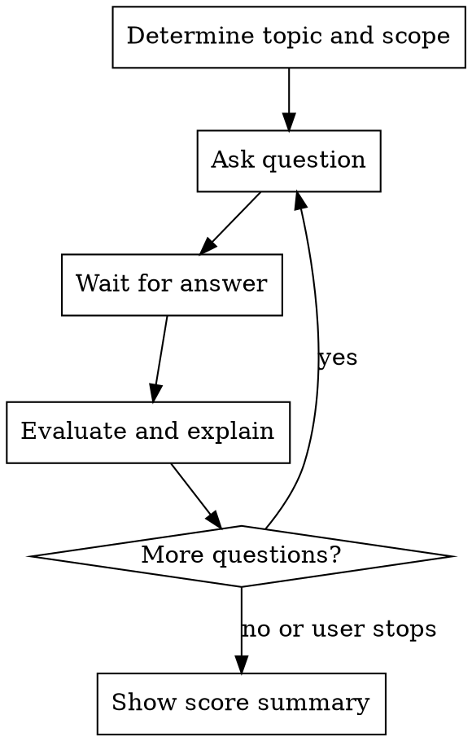

# Quiz Me

Interactive quiz that tests understanding through a mix of multiple-choice and open-ended questions.

## How to Use

Invoke with `/quiz-me [topic]` or just `/quiz-me` and specify the topic when asked.

Examples: `/quiz-me TCP sockets`, `/quiz-me git`, `/quiz-me sorting algorithms`

## Quiz Flow



## Rules

1. **One question per message.** Never batch questions.
2. **Mix formats:** Alternate between multiple-choice (4 options) and open-ended. Use multiple-choice for factual recall, open-ended for conceptual understanding.
3. **Grade fairly:** For open-ended answers, accept correct reasoning even if wording is imprecise. If partially correct, say what was right and what was missing.
4. **Explain after every answer:** Whether right or wrong, give a brief explanation of WHY the correct answer is correct. This is the learning moment.
5. **Adapt difficulty:** Start medium. If the user gets 2+ right in a row, increase difficulty. If they get 2+ wrong, ease up and cover fundamentals.
6. **Stay on topic:** Draw questions from the specified topic and related sub-topics. If the user is working on a project, tailor questions to concepts they'll actually need.
7. **Track score:** Keep a running tally (e.g., "3/5 correct"). Show final summary when the quiz ends.
8. **Let the user control pace:** The quiz ends when the user says stop, or after 10 questions if no limit was specified. Ask "Continue?" after every 5 questions.
9. **Use context:** If inside a project directory, read relevant files to generate questions about the actual codebase or assignment requirements — not just generic textbook questions.
10. **No trick questions.** Every question should teach something useful.
11. **Update knowledge tracking:** After the quiz, update `memory/knowledge_gaps.md` — move correct answers toward Solid, wrong answers toward Weak.

## Question Format

**Multiple choice:**
```
Q3 (medium): What system call creates a new socket in C?

  a) connect()
  b) socket()
  c) bind()
  d) listen()
```

**Open-ended:**
```
Q4 (medium): In your own words, explain why FTP uses two separate TCP connections instead of one.
```

## After Each Answer

```
Correct! [or] Not quite.

[Brief explanation of the correct answer and why it matters]

Score: 3/4
```

## Score Summary

At the end of the quiz, show:
```
── Quiz Complete ──────────────────
Topic: [topic]
Score: 7/10 (70%)

Strong areas: [what they got right]
Review these: [concepts they struggled with]
───────────────────────────────────
```

Then update knowledge tracking in memory.

## Integration with Other Skills

This skill is part of the **claude-teacher** plugin. It shares state with sibling skills:

- **`/teach-mode`** — the main tutoring skill. Quiz results feed into its knowledge tracking. After a quiz, teach-mode picks up weak areas automatically.
- **`/illustrate [concept]`** — if a question involves a visual concept and the student got it wrong, offer to illustrate it for better understanding.
- **`/init-edu`** — must be run once to set up knowledge tracking.

**Shared state:** Read `memory/knowledge_gaps.md` at quiz start to prioritize weak/learned topics. Update it at quiz end with results.

**Priority order for questions:**
1. Topics marked **Weak** in knowledge tracking (highest priority)
2. Topics marked **Learned** that haven't been verified
3. New topics related to the current project
4. General topic knowledge
